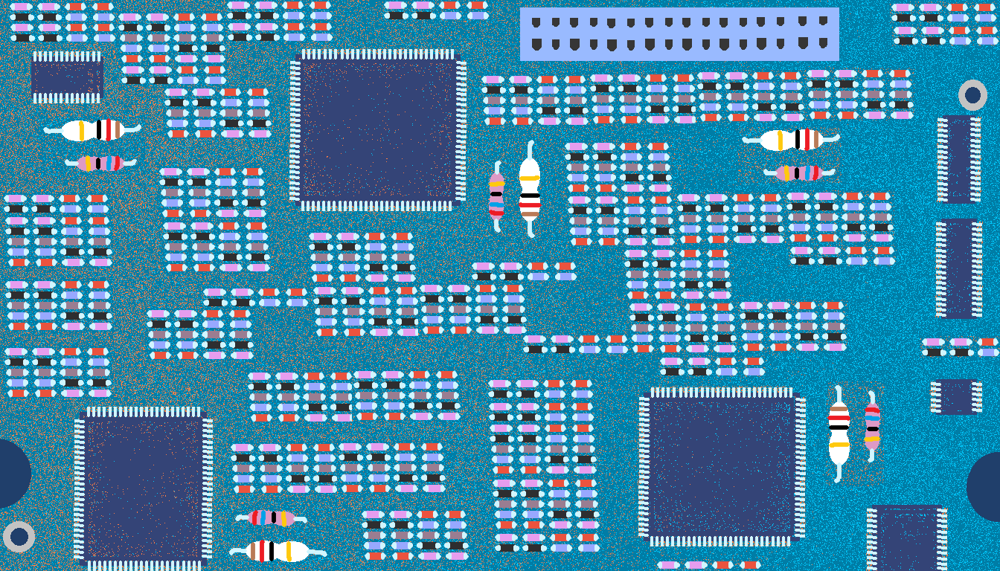
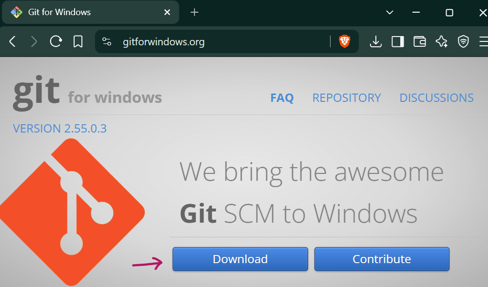
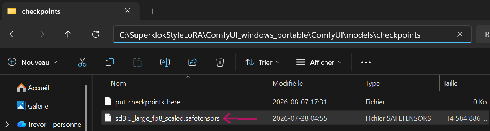
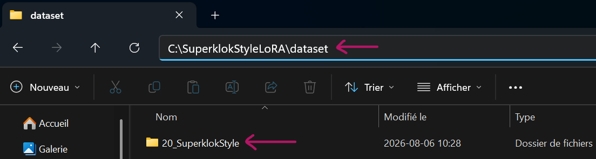
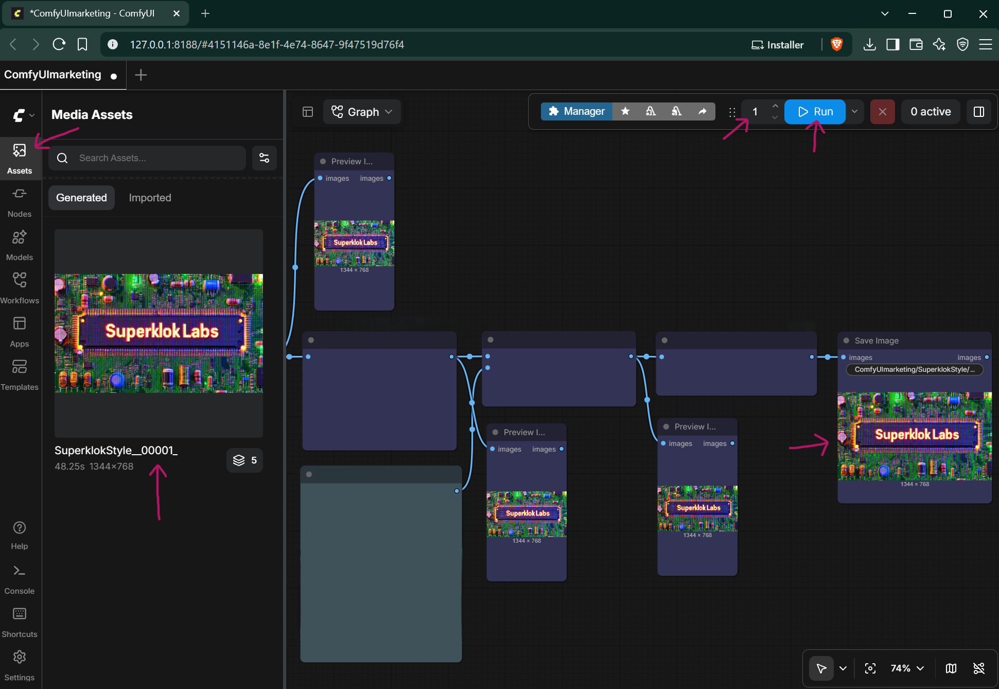
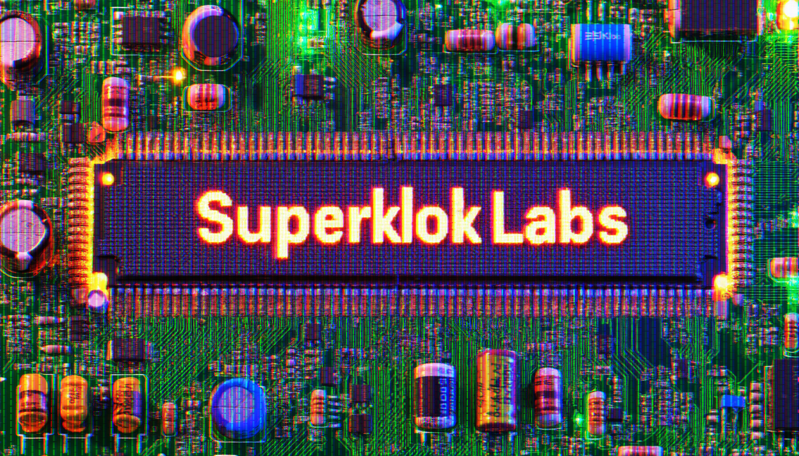

# 📺 SuperklokStyleLoRA: 100% Commercially Usable Style LoRA v1.0.1


`SuperklokStyleLoRA` is a 100% Commercially Usable specialized style fine-tuning model architecture trained natively on **Stable Diffusion 3.5 Large** using an all-in-one local ComfyUI interface. Visit [Hugging Face](https://huggingface.co/Superklok/SuperklokStyleLoRA/blob/main/SuperklokStyleLoRA.safetensors) to download `SuperklokStyleLoRA` for FREE!

This LoRA reproduces ultra-saturated, neon-green circuit board backgrounds, copper soldering points, glossy hardware capacitors, and authentic analog horizontal CRT television monitor scanlines.

---

## 💵 The Ultimate Commercial Core
Unlike LoRAs and workflows tied to restrictive non-commercial licenses, **this entire architecture is 100% free for commercial use.** 

* **Indie Game Devs:** Generate menus, title screens, and concept art locally.
* **Content Creators:** Automate flashy and unique marketing image generation.
* **IP Creators:** Monetize your original marketing images, workflows, and visual outputs with zero subscription overhead.

`SuperklokStyleLoRA` was created with the help of `ComfyUImarketing`, which specializes in turning primitive MS Paint drawings, combined with text prompts, into highly detailed 100% commercially usable images. The original uploaded reference image `Superklok Labs Banner.png` for the `SuperklokStyleLoRA` began as a primitive MS Paint drawing, here are the steps of its development using the `ComfyUImarketing` workflow.

 ➡️ ⤵️
 ➡️ 

Visit [Upwork](https://www.upwork.com/freelancers/~01a2b86360ffeb733e)/[Contra](https://contra.com/Superklok) to get your copy of the `ComfyUImarketing` 100% commercially usable marketing automation engine today!

---

## 📊 Model Technical Details
* **Base Architecture Compatibility:** Stable Diffusion 3.5 Large (fp8 scaled / fp16 / bf16)
* **Native Trained Resolution:** 1344x768 (Landscape centered-crop dataset layout)
* **Required Activation Token:** `Superklok Style`
* **Dataset Density:** 120 hand-selected art style images at 20 processing iterations per file (2,700 total training steps).
* **Final loss value**: 0.1404, a stellar, textbook-perfect score for an intricate Style LoRA. Style models naturally hold a slightly higher final loss value than characters (for example, 0.10 to 0.15 vs [SunnyChuxemLoRA](https://github.com/Superklok/SunnyChuxemLoRA) character LoRA's 0.02). This is exactly what we want because it prevents the model from being rigid. It captured the layout texture, the scanlines, and the branding layout without losing its creative flexibility.

---

## 🚀 Native ComfyUI Training Architecture
This repository includes the official `ComfyUI Workflow - SuperklokStyleLoRA.json` workflow file. Users can train this model locally entirely within ComfyUI without installing terminal command suites, command-line environments, or complex external dependencies.

---

## INSTALLATION GUIDE

## 🎨 Step-by-Step Setup: ComfyUI Automation Workflow

Follow these steps to configure the image-generation pipeline. This workflow is optimized to run on a single 16GB VRAM graphics card.

### Prerequisites
* An NVIDIA GPU with 16GB+ VRAM (Optimized for RTX 4070 Ti, 5070 Ti, or similar).
* The `SuperklokStyleLoRA\dataset\20_SuperklokStyle\` folder.
* The `ComfyUI Workflow - SuperklokStyleLoRA.json` workflow file included in the `SuperklokStyleLoRA\` folder.
* The `captioner.py` script in the `SuperklokStyleLoRA\` folder.

---

> ⚠️ **IMPORTANT NOTE:** Download the **SuperklokStyleLoRA** GitHub repository directly to the folder location where you intend to run your applications. **SuperklokStyleLoRA** is a fully portable and 100% offline-capable environment. All related application files, models, and caches live strictly inside the main installation folder. Once set up, you can completely disconnect your system from the internet without losing any functionality.

### Step 1: Install ComfyUI (Portable Windows Build)



1. You will first need to install Git for Windows from the official page (https://gitforwindows.org/). The direct download link is https://github.com/git-for-windows/git/releases/download/v2.55.0.windows.3/Git-2.55.0.3-64-bit.exe


2. Download the official **ComfyUI Windows Portable Build** from the ComfyUI Downloads Page (https://docs.comfy.org/installation/comfyui_portable_windows).


3. Extract the downloaded `ComfyUI_windows_portable_nvidia.7z` archive into your `SuperklokStyleLoRA\` folder, then go inside the resulting `ComfyUI_windows_portable_nvidia` folder and not the `.7z` archive.

4. Open the `SuperklokStyleLoRA\ComfyUI_windows_portable` folder. You will see several batch files, an `advanced` folder, a main `ComfyUI` folder, a `python_embeded` folder, and an `Update` folder.

> ⚠️ **NOTE:**Make sure the `ComfyUI_windows_portable_nvidia` folder contains all the ComfyUI files and is placed directly in the `SuperklokStyleLoRA\` folder.

---

### Step 2: Configure the VRAM-Optimized Startup Script

To prevent ComfyUI from locking your graphics card and crashing your local chatbot backend, modify the startup configurations:


1. Right-click the file named `run_nvidia_gpu.bat` and select **Edit** (or open it with Notepad).


2. Replace the entire default text line at the top of the file with the following optimized command:
   ```python
   .\python_embeded\python.exe -s ComfyUI\main.py --windows-standalone-build --fp8_e4m3fn-text-enc --use-pytorch-cross-attention
   ```
3. Save the `run_nvidia_gpu.bat` file and close your text editor. 

---

### Step 3: Download the ComfyUI Manager


1. Browse to your `SuperklokStyleLoRA\ComfyUI_windows_portable\ComfyUI\custom_nodes` folder and open a Command Prompt inside that folder by clicking in the **Address Bar** at the top, typing `cmd`, and pressing Enter. This will open a Command Prompt terminal in your `custom_nodes` folder.


2. Once the black box (Command Prompt) pops up, type the following into it and press Enter: 
   ```shell
   git clone https://github.com/ltdrdata/ComfyUI-Manager comfyui-manager
   ```
3. Close the Command Prompt terminal window once the download operation is complete.

---

### Step 4: Load the Automated Workflow & Dependencies 

 ➡️ 

1. Download `sd3.5_large_fp8_scaled.safetensors` from https://huggingface.co/Comfy-Org/stable-diffusion-3.5-fp8/blob/main/sd3.5_large_fp8_scaled.safetensors and place it in your `SuperklokStyleLoRA\ComfyUI_windows_portable\ComfyUI\models\checkpoints` folder.


2. Browse to your `SuperklokStyleLoRA\ComfyUI_windows_portable` folder and double-click your modified `run_nvidia_gpu.bat` file. A browser window will open automatically at `http://127.0.0.1:8188`. It may take a couple minutes to launch for the first time after installing ComfyUI.

3. Locate the `ComfyUI Workflow - SuperklokStyleLoRA.json` workflow file inside the `SuperklokStyleLoRA\` folder.

 ➡️ 

4. Drag and drop the `ComfyUI Workflow - SuperklokStyleLoRA.json` workflow file directly into the ComfyUI browser interface to load the automated pipeline.



5. Browse to your `SuperklokStyleLoRA\dataset` folder and copy the `20_SuperklokStyle` folder.


6. Paste the `20_SuperklokStyle` dataset into the `SuperklokStyleLoRA\ComfyUI_windows_portable\ComfyUI\input` folder.


7. Enter the number of LoRAs you would like to train sequentially, then press `Run` to train the amount of LoRAs you requested. Your trained LoRA files can be found in the `SuperklokStyleLoRA\ComfyUI_windows_portable\ComfyUI\output\models\loras` folder.


When training your own LoRAs, you can use the `captioner.py` script found in your `SuperklokStyleLoRA\` folder to create `.txt` files to accompany each of your LoRA training images.


If you're interested in owning a custom version of the same Premium ComfyUI Workflow that generated the images used to train `SuperklokStyleLoRA`, then reach out through [Upwork](https://www.upwork.com/freelancers/~01a2b86360ffeb733e) or [Contra](https://contra.com/Superklok) to order your very own custom copy of the `ComfyUImarketing` 100% Commercially Usable Marketing Automation Engine today! Here's an output sample from using the `SuperklokStyleLoRA` through the `ComfyUImarketing` workflow:

 



Your 100% Commercially Usable LoRA training workflow is ready to go, and the parameters can easily be modified to train your own custom LoRAs!

---

# 🚀 100% Commercial Use ComfyUI Workflow & SuperklokStyleLoRA

**SuperklokStyleLoRA** is a Superklok Labs production-grade style asset and LoRA purpose-built for applying the Superklok art style to AI generated imagery. 

Unlike traditional assets, this style LoRA is released with **zero commercial restrictions**. You are fully authorized to use this asset in commercial video games, software applications, marketing campaigns, and creative projects completely free of charge.

---

## 🛠️ Need Custom ComfyUI Workflows or AI Pipelines?
While this style LoRA is completely free, achieving perfect consistency, hyper-speed rendering, and automated production pipelines requires specialized engineering. 

If you need a custom-built generation pipeline, bespoke style LoRAs for your brand, or optimized ComfyUI enterprise workflows, let's build it together!

**Hire me directly on your preferred freelance platform:**
* 💼 **Hire on [Upwork](https://www.upwork.com/freelancers/~01a2b86360ffeb733e)**
* ⚡ **Hire on [Contra](https://contra.com/Superklok)**
* 🌐 **Portfolio on [GitHub](https://github.com/Superklok)**

---

## 📊 Benchmark Capabilities
The `SuperklokStyleLoRA` asset is explicitly engineered to test the limits of your generative pipelines:
* **High-Fidelity Consistency:** Perfect for testing seed stability, IP-Adapter configurations, and ControlNet weighting.
* **SFW / Production-Ready:** Clean, professional aesthetics suitable for corporate demos, marketing campaigns, and open-source testing.
* **Architecture Agnostic:** Optimized for seamless integration across Stable Diffusion architectures and custom ComfyUI nodes.

---

## 📜 License & Commercial Use (Summary)

This repository is distributed under the **SUPERKLOK LABS UNIFIED PUBLIC ASSET LICENSE v1.0**. 

* **100% Free for Commercial Use**: You are fully permitted to use the ComfyUI workflows, LoRA models, and test images to generate commercial artwork.
* **Mandatory Attribution**: You must credit **Superklok Labs** by linking to or tagging one of the official handles (for example, [Twitter(X)](https://x.com/SuperklokLabs) or [Instagram](https://www.instagram.com/superkloklabs/)) whenever you publish content created or upscaled with these assets.

See the full [LICENSE](LICENSE) file for legal details and the complete list of attribution links.

---

💡 *If you find this project useful, reach out via [Upwork](https://www.upwork.com/freelancers/~01a2b86360ffeb733e)/[Contra](https://contra.com/Superklok) to scale up your studio's AI infrastructure!*